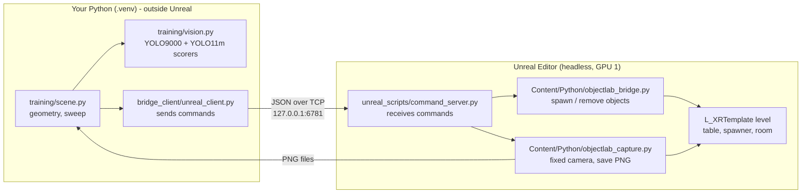
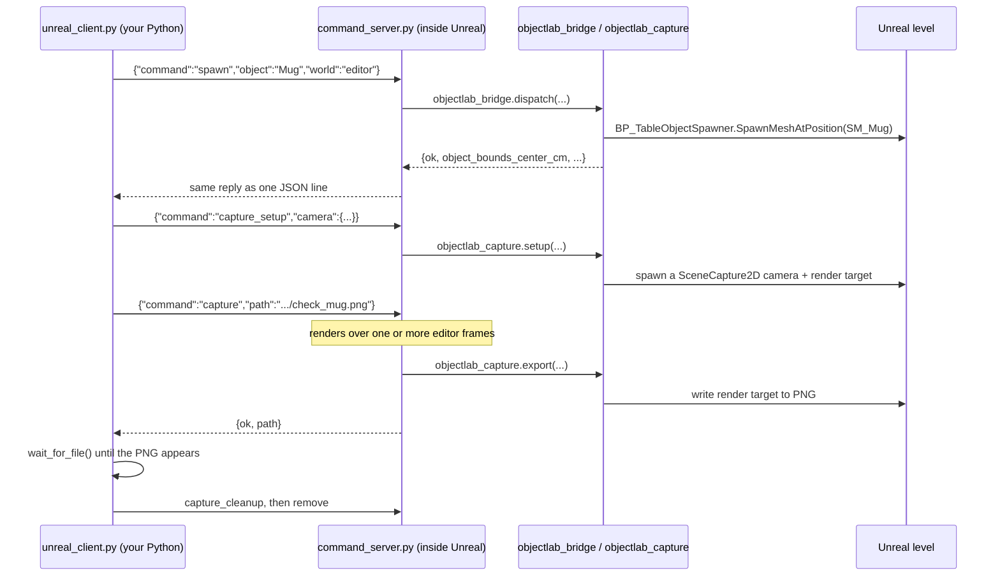

# How the code works

A guided tour of everything in this repo and the Unreal project it drives: what each file does,
how the pieces talk to each other, and what has changed underneath them. Last updated 2026-10-06.

If you only read one section, read [The big picture](#the-big-picture) and
[One request, start to finish](#one-request-start-to-finish). For *why* things are the way they
are (decisions, measurements, findings), see [reports/meeting3_report_notes.md](reports/meeting3_report_notes.md).

---

## The big picture

The goal: an object sits on a table in a virtual room. A camera looks at it. A flashlight moves
around the object, and a vision model (YOLO9000) tries to identify the object. The current stage
measures how identification changes with the light's position for 107 objects; later an RL agent
will learn to place the light.

There are **two programs running at once**, and almost everything in this repo exists to let them
talk to each other:



1. **Unreal** renders the room. It runs with no screen (headless) on GPU 1 of the server.
2. **`command_server.py`** runs *inside* Unreal and listens on a local port for commands such
   as "spawn a mug", "move the light here" and "take a picture".
3. **`unreal_client.py`** runs in your normal Python and sends those commands.
4. **`scene.py`** works out where the camera and light should go, sends the commands, reads back
   the pictures, and runs the sweep.
5. **`vision.py`** runs YOLO9000 (and YOLO11m for comparison) on each picture: confidence,
   top-3 guesses, and whether the answer is correct.

Python inside Unreal and Python outside it are **separate processes**. They can't call each
other's functions directly. The only links between them are the TCP socket (for commands) and
image files on disk (for pictures).

---

## Where everything lives

| Location | What it is | Who owns it |
|---|---|---|
| `~/vr-nav-rl` (this repo) | Your code, plus reports and deliverables | You (GitHub `alek03/lighting-VR-RL`) |
| `/opt/Unrealprojects/tufaelz` | The **live** Unreal project: level, meshes, materials, the lab's Python bridge. Others edit it. | Bradley (bpw10) |
| `/opt/Unrealprojects/tufaelz_frozen_2026-10-06` | **Frozen copy** of the live project (Content, Config, Scripts, Docs) used for the sweep, so results are reproducible | You |
| `/opt/Unrealprojects/tufaelz_old` | Your Sep 23 copy, from before Bradley's Oct 5 update (10 objects, old lighting) | You |
| `…/Content/Python/objectlab_*.py` | Python that runs inside Unreal. **Your server imports these.** | Bradley |
| `…/Scripts/pose.json` | The recorded VR camera pose; your code reads its position | Bradley |
| `…/Config/objectlab_objects.json` | The list of 115 object names (catalogue ids 1–115) | Bradley |
| `/opt/Unrealprojects/darknet` | Darknet and the YOLO9000 weights, config and class tree (`data/9k.*`) | Labmate npg5522 |
| `/opt/UnrealEngine/UE-5.8.2` | The engine itself | Server |

Your repo, folder by folder:

```
vr-nav-rl/
├── HOW_IT_WORKS.md          ← this file
├── README.md
├── infra/
│   ├── start_editor.sh      ← USE THIS: launches Unreal + command server on a chosen GPU
│   ├── stop.sh              ← USE THIS: stops YOUR Unreal (and the old stack), shows GPU memory
│   ├── start.sh             ┐
│   ├── launch_ue.sh         │  older "live viewer" stack for the render_test demo;
│   ├── frame_server.py      │  not used by the flashlight task (see the end of this doc)
│   ├── control_bridge.py    │
│   └── walk_agent.py        ┘
├── unreal_scripts/
│   └── command_server.py    ← runs INSIDE Unreal
├── bridge_client/
│   └── unreal_client.py     ← talks to the server; library + command line
├── training/
│   ├── scene.py             ← camera/light geometry, mask helpers, calibrate, sweep, room map
│   ├── vision.py            ← YOLO9000 scorer (the measure) + YOLO11m scorer (comparison)
│   ├── deliverables.py      ← builds the figures in deliverables/ from a sweep
│   ├── object_classes.json  ← ground truth: which YOLO9000 classes count as correct, per object
│   ├── object_scale.json    ← scale fixes for 7 mis-sized models
│   ├── scene_config.json    ← camera/light settings chosen by calibration (generated)
│   └── calibration.md       ← calibration report from the first runs (generated; don't edit)
├── reports/
│   └── meeting3_report_notes.md   ← running notes: decisions, measurements, findings, plan
├── deliverables/            ← final figures (gitignored; see deliverables/README.md)
├── captures/                ← images, incl. sweep frames (gitignored)
├── logs/                    ← editor.log, sweep_run.log, older JSON results (gitignored)
├── models/                  ← yolo11m.pt weights (gitignored)
└── requirements.txt
```

---

## One request, start to finish

Here is what happens when you run

```bash
UE_COMMAND_PORT=6781 .venv/bin/python -m bridge_client.unreal_client check --object Mug
```



Step by step:

1. **The client opens a TCP connection** to `127.0.0.1:<port>`
   ([`UnrealClient`](bridge_client/unreal_client.py:33)). The port comes from `UE_COMMAND_PORT`
   (default 6780; use 6781 on this machine, because a labmate's editor uses 6780).
2. **It sends one line of JSON** per command and waits for one line of JSON back
   (`UnrealClient.call`). If the reply has `"ok": false`, the client raises `UnrealError`.
3. **Inside Unreal, the server gets a turn on every rendered frame.** Unreal only allows its
   Python API to be used from its main ("game") thread, so the server registers a function that
   Unreal calls once per frame ([`Server.tick`](unreal_scripts/command_server.py:361)). On each
   call it accepts new connections, reads waiting data, and runs any complete commands.
4. **The server looks the command up in a fixed table**
   ([`COMMANDS`](unreal_scripts/command_server.py:303)). Unknown commands are rejected, so it
   can't be used to run arbitrary code.
5. **Some commands hand off to the lab's own modules.** `spawn`, `remove` and `status` go to
   `objectlab_bridge.dispatch()`. The camera commands go to `objectlab_capture`.
6. **Some commands need several frames.** [`_capture`](unreal_scripts/command_server.py:134) and
   [`_capture_mask`](unreal_scripts/command_server.py:150) are Python *generators*: each `yield`
   means "let Unreal render a frame, then continue me". The server advances them one step per
   tick, and their `return` value becomes the reply.
7. **The picture travels as a file, not over the socket.** Unreal writes a PNG and the client
   polls until the file exists ([`wait_for_file`](bridge_client/unreal_client.py:62)).

### Why not use Unreal's built-in remote Python?

The tufaelz project enables Epic's *Python Remote Execution*, and Bradley's Windows tools use it.
On this Linux server its discovery (UDP multicast) never works with the safe localhost-only
setting, and making it work would expose "run any Python" to the network. So
`command_server.py` is a small, localhost-only replacement that only accepts named commands.

---

## File by file

### `infra/start_editor.sh`: start Unreal

[infra/start_editor.sh](infra/start_editor.sh)

```bash
PROJECT=/opt/Unrealprojects/tufaelz_frozen_2026-10-06/tufaelz.uproject UE_COMMAND_PORT=6781 ./infra/start_editor.sh
```

Launches the full Unreal **editor** (the lab's bridge uses editor-only features) with:

| Flag / setting | Why |
|---|---|
| `-RenderOffScreen -vulkan` | No display on this server. Without this the engine crashes looking for a screen. |
| `-graphicsadapter=N` | Chooses the GPU. **Unreal ignores `-gpuindex`** (the old flag); `-graphicsadapter` works but counts GPUs in Vulkan's order, which here is `nvidia-smi`'s shifted by one (adapter 0 = GPU 3, 1 = GPU 0, 2 = GPU 1). The script takes `GPU_INDEX` as the `nvidia-smi` number (default **1**) and converts it. |
| map as a **file path** | A `/Game/...` map path fails to load ("Map load failed. The filename ''…") when the project folder and `.uproject` names differ, as in the frozen copy. |
| `-dpcvars="r.TextureStreaming=0"` | Otherwise textures stay blurry: Unreal picks texture detail from the main viewport, which never looks at the table. |
| `-ExecCmds="py .../command_server.py"` | Loads the command server after startup. (`-ExecutePythonScript` would run it and then **quit**.) |

It waits for `command_server: listening` in `logs/editor.log` (about 1–2 minutes; ~11 minutes
the first time, while shaders compile), then **checks with `nvidia-smi` that the editor really is
on the requested GPU** and that the map loaded, and warns if not.

Stop it with `./infra/stop.sh`, which only stops **your own** Unreal processes.

### `unreal_scripts/command_server.py`: the server inside Unreal

[unreal_scripts/command_server.py](unreal_scripts/command_server.py)

This is the only file of yours that runs inside Unreal. It can `import unreal`, which isn't
possible from your normal Python. On import it adds the project's `Content/Python` folder to the
path so it can import `objectlab_bridge` and `objectlab_capture`, then starts the server and
hooks it into Unreal's per-frame tick.

All commands it understands:

| Command | What it does | Implemented by |
|---|---|---|
| `ping` | Is the server alive? Returns the frame count and FPS. | here |
| `describe` | Table centre, every light, nearby walls/floor, BP_Torch's light settings, and the stored size of every catalogue object. | here |
| `status` | What's on the table right now. | `objectlab_bridge.dispatch` |
| `spawn` | Puts an object on the table (by name or number), replacing the old one. Since Oct 5 the bridge also puts it on **lighting channel 1 only**. | `objectlab_bridge.dispatch` |
| `remove` | Clears the table. | `objectlab_bridge.dispatch` |
| `scale_object` | Uniformly scales the object on the table (the mis-sized-model workaround). | here |
| `capture_setup` | Creates the photo camera (a `SceneCapture2D`) at a given position, rotation and FOV. | `objectlab_capture.setup` |
| `capture` | Renders `settle_frames` extra frames, then saves a PNG. Multi-frame (generator). | here + `objectlab_capture.export` |
| `capture_mask` | Saves the **object alone, unlit** (its base colour on black): its exact silhouette, independent of lighting and shadows. Restores the camera afterwards. | here |
| `capture_cleanup` | Deletes the photo camera. | `objectlab_capture.cleanup` |
| `light_setup` | Creates **the flashlight**: a movable spotlight that copies BP_Torch's settings ([`TORCH_LIGHT_PROPS`](unreal_scripts/command_server.py:49)), so it matches the human's torch in VR. | here |
| `set_light` | Moves the flashlight to `location` and points it at `target`. | here |
| `light_cleanup` | Deletes the flashlight. | here |
| `play` | Starts or stops Simulate-in-Editor. Not currently used. | here |
| `set_cvars` | Sets `r.*` rendering settings (numbers only). | here |

Details worth knowing:

- **Lighting channels.** Since Bradley's Oct 5 update, table objects only receive light on
  channel 1, and a new spotlight is on channel 0 only, so our flashlight left objects pitch
  black. `TORCH_LIGHT_PROPS` therefore also copies `lighting_channels` from BP_Torch (channels
  0 and 1).
- **Reading BP_Torch's settings** ([`_read_torch`](unreal_scripts/command_server.py:95)): a
  Blueprint's components only exist on a placed copy, so the server spawns a BP_Torch 100 m below
  the floor, reads its spotlight, and deletes it again.
- **The mask** ([`_capture_mask`](unreal_scripts/command_server.py:150)) uses the camera's
  "show only these actors" list. That list can't be set as a property from Python; it uses the
  component's `show_only_actor_components` / `clear_show_only_components` functions.
- **Reloading is safe**: re-running the script shuts down the previous server first.

### `bridge_client/unreal_client.py`: the client

[bridge_client/unreal_client.py](bridge_client/unreal_client.py)

**As a library** (this is how `scene.py` uses it):

```python
from bridge_client.unreal_client import UnrealClient
with UnrealClient() as ue:                     # port from UE_COMMAND_PORT
    ue.call('spawn', object='Mug', world='editor')
```

`call(command, **args)` turns keyword arguments into the JSON request, so any command above
works, e.g. `ue.call('set_light', location=[...], target=[...])`.

**From the command line**: `ping`, `status`, `describe`, `remove`, `spawn <name>`, and
`check --object Mug` (spawn, one photo into `captures/`, clean up).

### `training/scene.py`: geometry, masks and the sweep

[training/scene.py](training/scene.py)

**1. Geometry (pure maths, no Unreal):**

- [`camera_pose`](training/scene.py:52) places the camera at the horizontal position in
  `Scripts/pose.json` (a person's seated head position in VR), at the configured height (165 cm),
  aims it at the object and **zooms** so the object fills a fixed fraction (`fill`, 0.5) of the
  frame. The zoom is set once per object and stays fixed for all its light positions. Per-object
  zoom keeps a 2 cm thimble and a 1 m guitar the same size in frame, so the score reflects
  lighting, not object size (a single wide view leaves small objects ~10–15 px wide, where YOLO
  can't recognise anything).
- [`light_position`](training/scene.py:63) turns *(azimuth, elevation, radius)* into a point on a
  sphere around the object. **The angles are relative to the camera**:

  ```
                    behind (az 180)
                         ●
                         │
   left (az 270) ●───── OBJ ─────● right (az 90)
                         │
                         ●
                    front (az 0)  ← the camera's side
                         │
                      [CAMERA]

   elevation: 0° = level with the object's centre, 90° = straight above it
  ```

  Units are Unreal's: **centimetres**, Z up.
- [`projected_box`](training/scene.py:75) projects the object's **stored 3D bounds** into the
  image (its 8 corners through the camera's position, angle and zoom), giving a 2D box. This is
  the "magenta box" in the check images.
- [`mask_box`](training/scene.py:91) is the tight box around a mask's pixels: the **true object
  box** used to check YOLO's boxes.

**2. `Scene`: a wrapper over the commands** ([`Scene`](training/scene.py:99))

| Method | What it does / sends |
|---|---|
| `Scene(ue, ...)` | `describe` (object sizes, torch settings), `light_setup` |
| `load(name)` | `spawn`, then `scale_object` if the object is in `object_scale.json`, then `aim_camera` → `capture_setup` |
| `light(az, el, r)` | `set_light` (position from `light_position`, aimed at the object centre) |
| `capture(settle)` | `capture` into a temp folder in `/dev/shm`, returned as a numpy image |
| `capture_mask()` | `capture_mask`; returns a True/False image of the pixels the object covers |
| `object_box()` | the projected stored-bounds box for the current object |
| `close()` | `light_cleanup`, `capture_cleanup`, `remove` |

It renders at **2× size and shrinks the image** (`supersample=2`), because scene captures get no
anti-aliasing.

**3. Command-line jobs** (all need the editor running):

| Command | What it does | Writes |
|---|---|---|
| `python -m training.scene sweep --out <folder>` | For every object in `object_classes.json` (or `--objects ...`): capture its mask, then render all 60 light positions (12 directions × 5 heights, 120 cm from the object), score each frame with YOLO9000 (and YOLO11m if the object has a COCO class), and check YOLO's box against the mask. **Resumes** where it left off if interrupted. | `<folder>/sweep.csv` (one row per object × position), `<folder>/frames/<Object>/el.._az...png`, `.../mask.png` |
| `python -m training.scene sweep --out <folder> --rescore` | Re-scores the saved frames with YOLO9000 (no Unreal needed), e.g. after changing `object_classes.json` or the box rule. Keeps light positions and YOLO11m scores; the old table is kept as `sweep_before_rescore.csv`. ~12 min. | `<folder>/sweep.csv` |
| `python -m training.scene calibrate` | From the first runs: settle time, framing (`fill`) and light radius, chosen by YOLO11m on the original 10 objects. | `scene_config.json`, `calibration.md`, `logs/calibration.json`, `captures/calibration/*.jpg`, `captures/room_map.png` |
| `python -m training.scene map` | Redraws the top and side view of the room with the camera, zoom range and light sphere. | `captures/room_map.png` |

**Sweep CSV columns:** object, catalogue id, elevation, azimuth, light position; the frame's
file; the accepted classes; **verdict** (correct / partial / wrong / none); **confidence** (for
the object's accepted classes); **top-3** guesses with confidences (and the top one's WordNet ID); YOLO's top box and its
objectness; **box check** against the mask: `iou`, `object_fraction` (share of YOLO's box that is
object pixels; low = mostly shadow or table), `coverage` (share of the object inside the box),
`centre_in_box`; the true box; and `yolo11m_confidence`.

### `training/vision.py`: the vision models

[training/vision.py](training/vision.py)

**`Yolo9000`** ([class](training/vision.py:62)) runs YOLO9000 through Darknet's Python wrapper on
the GPU (pin it with `CUDA_DEVICE_ORDER=PCI_BUS_ID CUDA_VISIBLE_DEVICES=1`).

- YOLO9000's ~9,000 classes form a **tree** (WordNet): thing → artifact → container → vessel →
  mug → coffee mug. Probabilities are nested: P(container) ≥ P(cup) ≥ P(teacup).
- Darknet's standard `detect()` keeps only one label per box. The full per-class probabilities
  are still in the network's output buffer after `get_network_boxes`, so the scorer reads all
  9,418 of them for every box.
- **confidence** = objectness × P(the object's accepted class), best over all boxes.
- **top-3** = the most specific classes with probability ≥ 0.1: walk down the tree from the root,
  following every child above the threshold, and keep the nodes where no child is.
- **verdict** for YOLO's most confident box (objectness ≥ 0.25, otherwise "none"): *correct* if
  its top guess is an accepted class or more specific **and** its box is on the object;
  *partial* if it's only a more general class (e.g. "ball" for Basketball); *wrong* otherwise,
  including any answer whose box is off the object.
- **On the object** means: the box overlaps the object's mask box with IoU ≥ 0.5, **or** at least
  half of the box is object pixels. The first accepts well-fitting boxes around thin or open
  objects (scissors); the second accepts boxes around a clear part of the object (a plant's pot);
  a box that is neither (shadow, lit table, background) fails.

**`Scorer`** ([class](training/vision.py:32)) is YOLO11m (COCO, 80 classes), kept for comparison
on the 31 objects that have a COCO class (`COCO_CLASS`, filled from `object_classes.json`).

### `training/deliverables.py`: the figures

[training/deliverables.py](training/deliverables.py)

```bash
.venv/bin/python -m training.deliverables captures/sweep_2026-10-06
```

Reads a sweep's `sweep.csv`, frames and masks, and writes `deliverables/`: per object a lighting
map (top-view room map: confidence and YOLO's result at each light position) and an image grid
(all 60 frames with YOLO's box and the true object box from the mask); overall a best-vs-worst
figure (the 6 objects where the light matters most), the recognition map (every object by
accuracy and confidence, coloured by whether YOLO9000 learned its class with boxes), the average
lighting map, and `0_overview.png`. See `deliverables/README.md`.

### `training/object_classes.json`: the ground truth

For each of the 107 objects: the YOLO9000 classes that count as correct, stored by **WordNet ID**
(names repeat with different meanings: "shoe" the footwear vs a kind of case), with each class's
parent classes to show which meaning is used; whether YOLO9000 learned that class with boxes
(only COCO's 80 classes had box training, the rest were learned from ImageNet photo labels); the
COCO class for YOLO11m; and review notes. Built by matching object names against YOLO9000's
class list, then cross-checked against **all WordNet synonyms** (YOLO9000 shows one name per
class: "hand blower" is the hair dryer). 8 objects are listed under `dropped`. Details and
decisions: the meeting 3 notes.

### `training/object_scale.json`: mis-sized models

Seven models in the Oct 5 update are **drawn at a different size from their stored bounds**
(e.g. the baseball's bounds say 7.4 cm but it renders at 15 cm; the chair renders at half
height). Unreal stores a model's bounds (used for placement, the magenta box and our camera
zoom) separately from the geometry it draws; normally they always agree. `Scene.load` scales
these objects by the listed factor so the drawn object matches its stored, realistic size. Each
was measured from the silhouette and verified afterwards. Remove an entry once Bradley fixes
that model.

### `training/scene_config.json` and `training/calibration.md`

**Generated by `calibrate`** in the first runs; don't edit by hand. Current settings: camera
height 165 cm, `fill` 0.5, light radius 120 cm, 640×640 images, 0 settle frames (re-measured in
the new lighting: still 0).

### The lab's code inside the Unreal project (not in this repo)

- **`Content/Python/objectlab_bridge.py`**: `context()` finds the world (`editor` or `pie`) and
  the single `BP_TableObjectSpawner`; `dispatch()` handles `status`, `spawn` and `remove`. It
  reads the object list from `Config/objectlab_objects.json`, spawns via `SpawnMeshAtPosition`
  (bypassing the Blueprint's old 10-name lookup), and sets objects to lighting channel 1.
- **`Content/Python/objectlab_capture.py`**: the `SceneCapture2D` photo camera and PNG export.
- **`Content/Python/objectlab_materials.py`**: a one-time tool Bradley ran to make every object
  material **non-glowing** (emissive = 0), so objects are only visible when lit.
- **`Scripts/`**: Bradley's Windows tools via Epic's remote execution (`objectlab_control.py`,
  `pose.py`, `screenshot.py`, `test_objectlab_bridge.py`). **You only use `pose.json`.**

`BP_TableObjectSpawner` sits at the table's top centre, (1120, −250, 80) cm; see the project's
`Docs/TableObjectSpawner.md`.

---

## GPUs on this machine

Four GPUs (`nvidia-smi` numbers 0–3). **You work on GPU 1** (announced to the lab).

| What | How it's pinned to GPU 1 |
|---|---|
| Unreal | `start_editor.sh` with `GPU_INDEX=1` (default) → `-graphicsadapter=2` |
| YOLO9000 (Darknet) and YOLO11m | `CUDA_DEVICE_ORDER=PCI_BUS_ID CUDA_VISIBLE_DEVICES=1` (then `cuda:0` inside the program is GPU 1) |

Always confirm with `nvidia-smi` after starting something. A labmate (mzt5720) runs an editor on
GPU 3, port 6780.

---

## What's on GitHub vs only on this server

GitHub has only the first two commits (skeleton and the old live-viewer stack). Everything for
the flashlight task is **still uncommitted**: `unreal_scripts/`, `bridge_client/`,
`infra/start_editor.sh` and `stop.sh`, all of `training/`, `reports/`, `HOW_IT_WORKS.md`,
`requirements.txt`, and edits to `README.md` and `.gitignore`. Committing is the last step of the
plan.

---

## The older live-viewer stack (`infra/` except `start_editor.sh` and `stop.sh`)

Built in September for a different demo (`render_test`, a third-person character).
**The flashlight task doesn't use any of it.** It shows how to *watch* Unreal live through SSH:

- `start.sh` starts Pixel Streaming's signalling server (input only), Unreal in game mode via
  `launch_ue.sh` (writing every frame with `-dumpmovie`), and `frame_server.py`.
- `frame_server.py` serves those frames as MJPEG on one port (`ssh -L 9847:localhost:8090 ...`).
- `control_bridge.py` drives a hidden Chromium that injects keyboard and mouse presses through
  Pixel Streaming.
- `walk_agent.py` walks the character in patterns as a smoke test.

These use system `python3` plus `requests` and `websocket-client` (not in `requirements.txt`),
and `launch_ue.sh` still uses the ignored `-gpuindex` flag.

---

## Glossary

| Term | Meaning here |
|---|---|
| **Editor world vs PIE** | The editor world is the level as you edit it. PIE ("Play In Editor") is a running copy with gameplay. Your code uses `world='editor'`. |
| **Game thread / tick** | Unreal's main loop; a tick is one pass (≈ one frame). Unreal's Python API is only safe on this thread. |
| **Blueprint (BP_…)** | Unreal's visual scripting class, e.g. `BP_TableObjectSpawner`, `BP_Torch`. |
| **Static mesh (SM_…)** | A 3D model asset, e.g. `SM_Mug`. |
| **Bounds** | The box Unreal stores with a model (its size), used for placement, collision and visibility checks. Should match the drawn geometry; for 7 models it doesn't. |
| **Mask** | A render of the object alone, unlit: exactly which pixels are the object. |
| **SceneCapture2D** | A camera that renders into an image instead of the screen. |
| **Lumen** | Unreal's real-time global illumination; why "settle frames" exist (currently 0 needed). |
| **Lighting channels** | Checkboxes (0, 1, 2) on lights and objects: a light only lights objects sharing a channel. |
| **FOV / fill** | The camera's field of view. `fill` = fraction of the frame the object spans; `camera_pose` computes the FOV from it. |
| **Azimuth / elevation / radius** | Where the flashlight sits on the sphere around the object. |
| **COCO / YOLO11m** | COCO is an 80-class image dataset; YOLO11m (2024) is trained on it. |
| **YOLO9000 / WordNet** | YOLO9000 (2016) names ~9,000 classes arranged as a WordNet tree; WordNet groups synonyms into one class with an ID (`wnid`). |
| **Objectness** | YOLO's confidence that a box contains *some* object, before saying which. |
| **IoU** | Intersection over union: overlap of two boxes, 0 (none) to 1 (identical). |
| **Generator / `yield`** | A Python function that can pause and resume; used for multi-frame commands. |

---

## Cheat sheet

```bash
cd ~/vr-nav-rl
export UE_COMMAND_PORT=6781                                       # 6780 is a labmate's
PROJECT=/opt/Unrealprojects/tufaelz_frozen_2026-10-06/tufaelz.uproject ./infra/start_editor.sh
.venv/bin/python -m bridge_client.unreal_client ping              # alive?
.venv/bin/python -m bridge_client.unreal_client check --object Mug    # one test photo → captures/
CUDA_DEVICE_ORDER=PCI_BUS_ID CUDA_VISIBLE_DEVICES=1 \
  .venv/bin/python -m training.scene sweep --out captures/sweep_2026-10-06   # the full sweep (~70 min)
tail -f logs/editor.log                                           # what Unreal is doing
nvidia-smi                                                        # check GPU placement
./infra/stop.sh                                                   # stop your Unreal, show GPU memory
```
