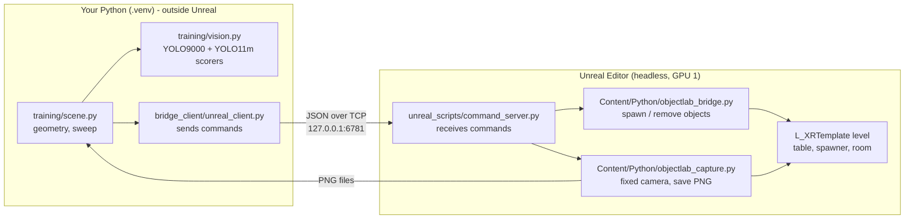
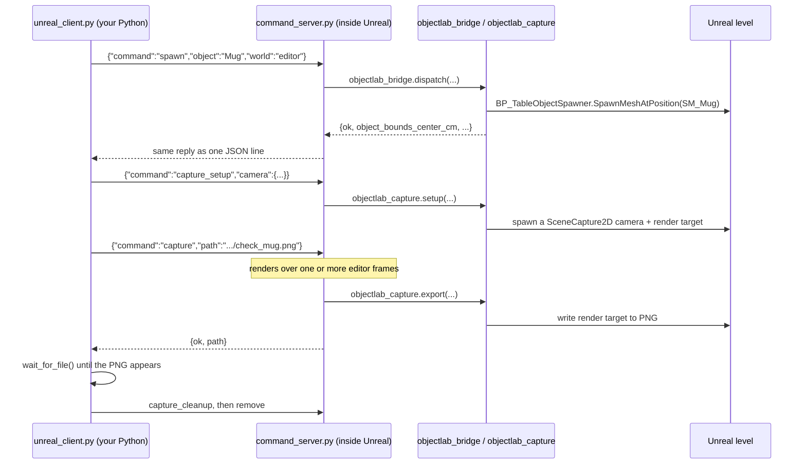

# How the code works

A guided tour of everything in this repo and the Unreal project it drives: what each file does,
how the pieces talk to each other, and what has changed underneath them. Last updated 2026-10-06.

If you only read one section, read [The big picture](#the-big-picture) and
[One request, start to finish](#one-request-start-to-finish). For *why* things are the way they
are (decisions, measurements, findings), see [reports/meeting3_report_notes.md](../reports/meeting3_report_notes.md).

---

## The big picture

The goal: an object sits on a table in a virtual room. A camera looks at it. A flashlight moves
around the object, and a vision model (YOLO9000) tries to identify the object. The current stage
measures how identification changes with the light's position for 107 objects; later an RL agent
will learn to place the light.

There are **two programs running at once**, and almost everything in this repo exists to let them
talk to each other:



1. **Unreal** renders the room. It runs with no screen (headless) on GPU 1 of the server.
2. **`command_server.py`** runs *inside* Unreal and listens on a local port for commands such
   as "spawn a mug", "move the light here" and "take a picture".
3. **`unreal_client.py`** runs in your normal Python and sends those commands.
4. **`scene.py`** works out where the camera and light should go, sends the commands, reads back
   the pictures, and runs the sweep.
5. **`vision.py`** runs YOLO9000 (and YOLO11m for comparison) on each picture: confidence,
   top-3 guesses, and whether the answer is correct.

Python inside Unreal and Python outside it are **separate processes**. They can't call each
other's functions directly. The only links between them are the TCP socket (for commands) and
image files on disk (for pictures).

---

## Where everything lives

| Location | What it is | Who owns it |
|---|---|---|
| `~/vr-nav-rl` (this repo) | Your code, plus reports and deliverables | You (GitHub `alek03/lighting-VR-RL`) |
| `/opt/Unrealprojects/tufaelz` | The **live** Unreal project: level, meshes, materials, the lab's Python bridge. Others edit it. | Bradley (bpw10) |
| `/opt/Unrealprojects/tufaelz_frozen_2026-10-06` | **Frozen copy** of the live project (Content, Config, Scripts, Docs) used for the sweep, so results are reproducible | You |
| `/opt/Unrealprojects/tufaelz_old` | Your Sep 23 copy, from before Bradley's Oct 5 update (10 objects, old lighting) | You |
| `…/Content/Python/objectlab_*.py` | Python that runs inside Unreal. **Your server imports these.** | Bradley |
| `…/Scripts/pose.json` | The recorded VR camera pose; your code reads its position | Bradley |
| `…/Config/objectlab_objects.json` | The list of 115 object names (catalogue ids 1–115) | Bradley |
| `/opt/Unrealprojects/darknet` | Darknet and the YOLO9000 weights, config and class tree (`data/9k.*`) | Labmate npg5522 |
| `/opt/UnrealEngine/UE-5.8.2` | The engine itself | Server |

Your repo, folder by folder:

```
vr-nav-rl/
├── README.md
├── ReadMes/                ← this file, plus one README per script
├── infra/
│   ├── start_editor.sh      ← USE THIS: launches Unreal + command server on a chosen GPU
│   ├── stop.sh              ← USE THIS: stops YOUR Unreal (and the old stack), shows GPU memory
│   ├── start.sh             ┐
│   ├── launch_ue.sh         │  older "live viewer" stack for the render_test demo;
│   ├── frame_server.py      │  not used by the flashlight task (see the end of this doc)
│   ├── control_bridge.py    │
│   └── walk_agent.py        ┘
├── unreal_scripts/
│   └── command_server.py    ← runs INSIDE Unreal
├── bridge_client/
│   └── unreal_client.py     ← talks to the server; library + command line
├── training/
│   ├── scene.py             ← camera/light geometry, mask helpers, calibrate, sweep, room map
│   ├── vision.py            ← YOLO9000 scorer (the measure) + YOLO11m scorer (comparison)
│   ├── deliverables.py      ← builds the figures in deliverables/ from a sweep
│   ├── object_classes.json  ← ground truth: which YOLO9000 classes count as correct, per object
│   ├── object_scale.json    ← scale fixes for 7 mis-sized models
│   ├── scene_config.json    ← camera/light settings chosen by calibration (generated)
│   └── calibration.md       ← calibration report from the first runs (generated; don't edit)
├── reports/
│   └── meeting3_report_notes.md   ← running notes: decisions, measurements, findings, plan
├── deliverables/            ← final figures (gitignored; see deliverables/README.md)
├── captures/                ← images, incl. sweep frames (gitignored)
├── logs/                    ← editor.log, sweep_run.log, older JSON results (gitignored)
├── models/                  ← yolo11m.pt weights (gitignored)
└── requirements.txt
```

---

## One request, start to finish

Here is what happens when you run

```bash
UE_COMMAND_PORT=6781 .venv/bin/python -m bridge_client.unreal_client check --object Mug
```



Step by step:

1. **The client opens a TCP connection** to `127.0.0.1:<port>`
   ([`UnrealClient`](../bridge_client/unreal_client.py:33)). The port comes from `UE_COMMAND_PORT`
   (default 6780; use 6781 on this machine, because a labmate's editor uses 6780).
2. **It sends one line of JSON** per command and waits for one line of JSON back
   (`UnrealClient.call`). If the reply has `"ok": false`, the client raises `UnrealError`.
3. **Inside Unreal, the server gets a turn on every rendered frame.** Unreal only allows its
   Python API to be used from its main ("game") thread, so the server registers a function that
   Unreal calls once per frame ([`Server.tick`](../unreal_scripts/command_server.py:361)). On each
   call it accepts new connections, reads waiting data, and runs any complete commands.
4. **The server looks the command up in a fixed table**
   ([`COMMANDS`](../unreal_scripts/command_server.py:303)). Unknown commands are rejected, so it
   can't be used to run arbitrary code.
5. **Some commands hand off to the lab's own modules.** `spawn`, `remove` and `status` go to
   `objectlab_bridge.dispatch()`. The camera commands go to `objectlab_capture`.
6. **Some commands need several frames.** [`_capture`](../unreal_scripts/command_server.py:134) and
   [`_capture_mask`](../unreal_scripts/command_server.py:150) are Python *generators*: each `yield`
   means "let Unreal render a frame, then continue me". The server advances them one step per
   tick, and their `return` value becomes the reply.
7. **The picture travels as a file, not over the socket.** Unreal writes a PNG and the client
   polls until the file exists ([`wait_for_file`](../bridge_client/unreal_client.py:62)).

### Why not use Unreal's built-in remote Python?

The tufaelz project enables Epic's *Python Remote Execution*, and Bradley's Windows tools use it.
On this Linux server its discovery (UDP multicast) never works with the safe localhost-only
setting, and making it work would expose "run any Python" to the network. So
`command_server.py` is a small, localhost-only replacement that only accepts named commands.

---

## File by file

Each script has its own README in this folder, with how to run it, its options, its outputs and
what to change when adapting it:

| Script | README |
|---|---|
| `infra/start_editor.sh`, `infra/stop.sh` | [start_editor.md](start_editor.md) |
| `unreal_scripts/command_server.py` | [command_server.md](command_server.md) |
| `bridge_client/unreal_client.py` | [unreal_client.md](unreal_client.md) |
| `training/scene.py` | [scene.md](scene.md) |
| `training/vision.py` | [vision.md](vision.md) |
| `training/deliverables.py` | [deliverables.md](deliverables.md) |
| `training/object_classes.json`, `object_scale.json`, `scene_config.json` | [data_files.md](data_files.md) |
| older live-viewer stack in `infra/` | [legacy_live_viewer.md](legacy_live_viewer.md) |

### The lab's code inside the Unreal project (not in this repo)

- **`Content/Python/objectlab_bridge.py`**: `context()` finds the world (`editor` or `pie`) and
  the single `BP_TableObjectSpawner`; `dispatch()` handles `status`, `spawn` and `remove`. It
  reads the object list from `Config/objectlab_objects.json`, spawns via `SpawnMeshAtPosition`, and
  sets objects to lighting channel 1.
- **`Content/Python/objectlab_capture.py`**: the `SceneCapture2D` photo camera and PNG export.
- **`Content/Python/objectlab_materials.py`**: a one-time tool Bradley ran to make every object
  material non-glowing (emissive = 0), so objects are only visible when lit.
- **`Scripts/`**: Bradley's Windows tools via Epic's remote execution (`objectlab_control.py`,
  `pose.py`, `screenshot.py`, `test_objectlab_bridge.py`). **This repo only uses `pose.json`.**

`BP_TableObjectSpawner` sits at the table's top centre, (1120, −250, 80) cm; see the project's
`Docs/TableObjectSpawner.md`.

---

## GPUs on this machine

Four GPUs (`nvidia-smi` numbers 0–3). **You work on GPU 1** (announced to the lab).

| What | How it's pinned to GPU 1 |
|---|---|
| Unreal | `start_editor.sh` with `GPU_INDEX=1` (default) → `-graphicsadapter=2` |
| YOLO9000 (Darknet) and YOLO11m | `CUDA_DEVICE_ORDER=PCI_BUS_ID CUDA_VISIBLE_DEVICES=1` (then `cuda:0` inside the program is GPU 1) |

Always confirm with `nvidia-smi` after starting something. A labmate (mzt5720) runs an editor on
GPU 3, port 6780.

---

## What's on GitHub

The code, docs and `object_classes.json` are on GitHub (`alek03/lighting-VR-RL`). Run outputs are
not: `captures/` (frames), `deliverables/`, `logs/` and `models/` are gitignored, because they are
large and can be regenerated.

---

## The older live-viewer stack

`infra/start.sh`, `launch_ue.sh`, `frame_server.py`, `control_bridge.py` and `walk_agent.py` were
built for an earlier demo and aren't used by the flashlight experiment; see
[legacy_live_viewer.md](legacy_live_viewer.md).

---

## Glossary

| Term | Meaning here |
|---|---|
| **Editor world vs PIE** | The editor world is the level as you edit it. PIE ("Play In Editor") is a running copy with gameplay. Your code uses `world='editor'`. |
| **Game thread / tick** | Unreal's main loop; a tick is one pass (≈ one frame). Unreal's Python API is only safe on this thread. |
| **Blueprint (BP_…)** | Unreal's visual scripting class, e.g. `BP_TableObjectSpawner`, `BP_Torch`. |
| **Static mesh (SM_…)** | A 3D model asset, e.g. `SM_Mug`. |
| **Bounds** | The box Unreal stores with a model (its size), used for placement, collision and visibility checks. Should match the drawn geometry; for 7 models it doesn't. |
| **Mask** | A render of the object alone, unlit: exactly which pixels are the object. |
| **SceneCapture2D** | A camera that renders into an image instead of the screen. |
| **Lumen** | Unreal's real-time global illumination; why "settle frames" exist (currently 0 needed). |
| **Lighting channels** | Checkboxes (0, 1, 2) on lights and objects: a light only lights objects sharing a channel. |
| **FOV / fill** | The camera's field of view. `fill` = fraction of the frame the object spans; `camera_pose` computes the FOV from it. |
| **Azimuth / elevation / radius** | Where the flashlight sits on the sphere around the object. |
| **COCO / YOLO11m** | COCO is an 80-class image dataset; YOLO11m (2024) is trained on it. |
| **YOLO9000 / WordNet** | YOLO9000 (2016) names ~9,000 classes arranged as a WordNet tree; WordNet groups synonyms into one class with an ID (`wnid`). |
| **Objectness** | YOLO's confidence that a box contains *some* object, before saying which. |
| **IoU** | Intersection over union: overlap of two boxes, 0 (none) to 1 (identical). |
| **Generator / `yield`** | A Python function that can pause and resume; used for multi-frame commands. |

---

## Cheat sheet

```bash
cd ~/vr-nav-rl
export UE_COMMAND_PORT=6781                                       # 6780 is a labmate's
PROJECT=/opt/Unrealprojects/tufaelz_frozen_2026-10-06/tufaelz.uproject ./infra/start_editor.sh
.venv/bin/python -m bridge_client.unreal_client ping              # alive?
.venv/bin/python -m bridge_client.unreal_client check --object Mug    # one test photo → captures/
CUDA_DEVICE_ORDER=PCI_BUS_ID CUDA_VISIBLE_DEVICES=1 \
  .venv/bin/python -m training.scene sweep --out captures/sweep_2026-10-06   # the full sweep (~70 min)
tail -f logs/editor.log                                           # what Unreal is doing
nvidia-smi                                                        # check GPU placement
./infra/stop.sh                                                   # stop your Unreal, show GPU memory
```
